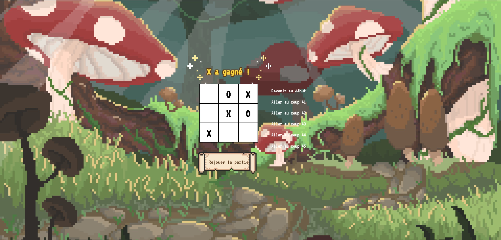

# 🎮 Tic-Tac-Toe
### *Un mini-jeu rétro développé par Marine Runavot*



Ce projet est une réécriture du classique **Tic-Tac-Toe**, développée en **React**, avec une direction artistique inspirée du **pixel art**.

Ce mini-jeu m’a permis de travailler :  
🎨 la personnalisation avancée en CSS,  
⚛️ la logique de composants React,  
🧩 la gestion d’état et de l’historique,  
🕹️ et l’amélioration de l’expérience utilisateur.

---

## ✨ Fonctionnalités

### 🎲 Gameplay
- Plateau **3×3** jouable à deux (X et O)
- Alternance automatique des joueurs
- Détection du **gagnant**
- Détection du **match nul**
- Interface réactive gérée uniquement avec des hooks React

### ⏳ Historique (Time Travel)
- Liste des coups joués à droite du plateau
- Possibilité de **revenir à un tour précédent**
- Mise à jour visuelle instantanée

### 📜 Bouton de redémarrage en style parchemin
- Utilise une image pixel art : `parchemin.png`
- Réinitialise entièrement :
  - le plateau  
  - l’historique  
  - l’état du jeu  
  - le statut affiché  

---

## 🧩 Structure du projet

```bash
src/
│
├── components/
│ ├── Game.jsx # Logique globale, historique, reset
│ ├── Board.jsx # Plateau, statut, étoiles
│ └── Square.jsx # Case unique (X / O)
│
├── utils/
│ └── calculateWinner.js # Détection du gagnant
│
├── assets/
│ ├── background.png
│ ├── parchemin.png
│ └── apercu.jpg
│
├── App.jsx
├── App.css
└── main.jsx
```

---

## 🛠️ Technologies utilisées

| Technologie | Rôle |
|------------|------|
| **React** | Composants fonctionnels, hooks, gestion d'état |
| **Vite** | Environnement de développement rapide |
| **JavaScript ES6+** | Logique du jeu et interactions |
| **CSS** | Effets pixel art, layout, décorations |

---

## 🚀 Installation & lancement

```bash
npm install
npm run dev
```

Application disponible sur :
```bash
http://localhost:5173/
```

---

## 👩‍💻 Auteur
Marine Runavot

Développeuse front-end en formation.
Intéressée par les interfaces créatives, React, et les designs rétro/pixel art.

📌 **Objectif du projet** : renforcer mes compétences en React et dans la personnalisation visuelle avancée (CSS pur).

---

## 📄 Licence

Ce projet est publié sous licence MIT.
Vous êtes libre de l’utiliser, le modifier et le partager.

